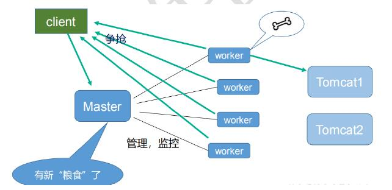

# nginx

---

## 1、nginx安装（linux）

* 安装nginx环境依赖
  * 配置yum源
  * 安装pcre 依赖、安装 openssl 、 zlib 、 gcc 依赖

* [nginx 官网下载软件](http://nginx.org/)

* 使用`tar -zxvf ***`命令解压、`./configure`命令、`make && make install`命令配置编译

* 启动nginx，进入目录 `/usr/local/nginx/sbin`中，`./nginx`启动nginx

## 2、测试访问nginx

* linux开启80端口访问权限

  * `vi /etc/sysconfig/iptables`、打开iptables的配置文件，添加一行

    `-A INPUT -m state --state NEW -m tcp -p tcp --dport 80 -j ACCEPT`。

  * 输入`service iptables restart`重启服务。

  * 输入`service iptables status`，回车就会显示正在生效的规则。

* 远程访问，ip:80端口，显示："Welcome to nginx!"。安装成功

## 3、ngnix常用命令

* 进入目录`/usr/local/nginx/sbin`

~~~properties
sudo nginx #打开 nginx
nginx -s reload|reopen|stop|quit  #重新加载配置|重启|停止|退出 nginx
nginx -t   #测试配置是否有语法错误

nginx [-?hvVtq] [-s signal] [-c filename] [-p prefix] [-g directives]

-?,-h           : 打开帮助信息
-v              : 显示版本信息并退出
-V              : 显示版本和配置选项信息，然后退出
-t              : 检测配置文件是否有语法错误，然后退出
-q              : 在检测配置文件期间屏蔽非错误信息
-s signal       : 给一个 nginx 主进程发送信号：stop（停止）, quit（退出）, reopen（重启）, reload（重新加载配置文件）
-p prefix       : 设置前缀路径（默认是：/usr/local/Cellar/nginx/1.2.6/）
-c filename     : 设置配置文件（默认是：/usr/local/etc/nginx/nginx.conf）
-g directives   : 设置配置文件外的全局指令
~~~

## 4、nginx配置文件

* 配置文件目录`/usr/local/nginx/conf`下的nginx.conf

* 包含三部分内容
  * 全局块：配置服务器整体运行的配置指令
    比如 worker_processes 1; 处理并发数的配置
    
  * events 块 ：影响 Nginx 服务器与用户的网络连接
    比如 worker_connections 1024; 支持的最大连接数为 1024
    
  * http 块
    
    ~~~properties
    Nginx的HTTP配置主要包括三个区块，结构如下：
    http { //这个是协议级别
    　　include mime.types;
    　　default_type application/octet-stream;
    　　keepalive_timeout 65;
    　　gzip on;
    　　　　server { //这个是服务器级别
    　　　　　　listen 80;
    　　　　　　server_name localhost;
    　　　　　　　　location / { //这个是请求级别
    　　　　　　　　　　root html;
    　　　　　　　　　　index index.html index.htm;
    　　　　　　　　}
    　　　　　　}
    }
    ~~~
    
    
    
    还包含两部分：
    http 全局块
    server 块

## 5、反向代理Demo

预期效果：打开浏览器，在浏览器地址栏输入地址 www.chenyn.com ，跳转到 liunx 系统 tomcat 主页
面中

* 配置启动tomcat
  * 解压tomcat，进入bin下运行程序
  * 开放8080端口

* 配置域名映射ip
  * 进入windows的 系统盘/windows/system32/drivers/etc
  * 编辑hosts，新增`192.168.209.128 www.chenyn.com`

* 配置nginx.conf

  * 修改http配置块下面的server块的`location /` 块

  ~~~properties
   location / {
              root   html;
              proxy_pass  http://127.0.0.1:8080;
              index  index.html index.htm;
          }
  ~~~

* 访问www.chenyn.com:80 可以访问到tomcat页面

预取效果：使用 nginx 反向代理，根据访问的路径跳转到不同端口的服务中、nginx 监听端口为 9001

访问 http:// 192.168.209.128 :9001/edu/ 直接跳转到 127.0.0.1:8080
访问 http:// 192.168.209.128 :9001/vod/ 直接跳转到 127.0.0.1:8081

* 准备两个 tomcat 服务器，一个 8080 端口，一个 8081 端口、创建文件夹和测试页面
* 开放端口8080、8081、9001

* 配置nginx.conf，修改http配置块下面的server块的`location /` 块

  ~~~properties
  location ~ /edu/ {
              root   html;
              proxy_pass  http://127.0.0.1:8080;
              index  index.html index.htm;
          }
  
   location ~ /vod/ {
             proxy_pass  http://127.0.0.1:8081;
          }
  ~~~

* 访问192.168.209.128:9001/edu/test.html和192.168.209.128:9001/vod/test.html

  会页面会跳转到8080 和8081 服务器

## 6、负载均衡Demo

预期效果：浏览器地址栏输入地址 http://192.168.17.129:9001/edu/test.html ，负载均衡效果，平均 8080 和 8081 端口中

* 启动两台tomcat,8080\8081

* 配置nginx.conf\修改http配置块，注意多个location会导致负载均衡失效

  ~~~properties
  upstream myserver {
        ip_bash;
        server  127.0.0.1:8080 weight=1;
        server  127.0.0.1:8081 weight=1;
      }
  server {
          listen       80;
          server_name  localhost;
          location / {
              proxy_pass http://myserver;
              proxy_set_header Host $host;
          }
  }
  ~~~

* 注意浏览器的缓存，尽量用chrome 的无痕模式访问。

* 负载均衡策略

  ~~~properties
  1、轮询（默认）
  每个请求按时间顺序逐一分配到不同的后端服务器，如果后端服务器 down 掉，能自动剔除。
  
  2、权重-weight
  weight 代表权重默认为 1, 权重越高被分配的客户端越多
  
  3、ip_hash（session共享问题）
  每个请求按访问 ip 的 hash 结果分配，这样每个访客固定访问一个后端服务器
  
  4、 fair （第三方）
  按后端服务器的响应时间来分配请求，响应时间短的优先分配。
  ~~~

## 7、动静分离Demo

`Nginx 动静分离简单来说就是把动态跟静态请求分开，不能理解成只是单纯的把动态页面和静态页面物理分离。严格意义上说应该是动态请求跟静态请求分开，可以理解成使用Nginx 处理静态页面，Tomcat处理动态页面`

一种是纯粹把静态文件独立成单独的域名，放在独立的服务器上，也是目前**主流推崇**的方案；

 另外一种方法就是动态跟静态文件混合在一起发布，通过 nginx 来分开。 通过 location 指定不同的后缀名实现不同的请求转发

* 服务器上新增静态资源文件夹

* 配置nginx.conf

  

  ~~~properties
       
          location /www/ {
             root  /home/chenyn/data/;
          }
  
          location /image/ {
             root  /home/chenyn/data/;
             ## 显示文件目录
             autoindex  on;
          }
  
  ~~~

  

* root 详解

  ```
  location ^~ /t/ {
       root /www/root/html/;
  }
  ```

  如果一个请求的URI是/t/a.html时，web服务器将会返回服务器上的/www/root/html/t/a.html的文件。

## 8、nginx 配置高可用的集群

待新增

## 9 、nginx原理




~~~properties
master-workers 的机制的好处
首先，对于每个
worker 进程来说，独立的进程，不需要加锁，所以省掉了锁带来的开销，
同时在编程以及问题查找时，也会方便很多。其次，采用独立的进程，可以让互相之间不会
影响，一个进程退出后，其它进程还在工作，服务不会中断， master 进程则很快启动新的
worker 进程。当然， worker 进程的异常退出，肯定是程序有 bug 了，异常退出，会导致当
前 worker 上的所有请求失败，不过不会影响到所有请求，所以降低了风险。

需要设置多少个
worker
Nginx
同 redis 类似都采用了 io 多路复用机制，每个 worker 都是一个独立的进程，但每个进
程里只有一个主线程，通过异步非阻塞的方式来处理请求， 即使是千上万个请求也不在话
下。每个 worker 的线程可以把一个 cpu 的性能发挥到极致。所以 worker 数和服务器的 cpu
数相等是最为适宜的。设少了会浪费 cpu ，设多了会造成 cpu 频繁切换上下文带来的损耗。
~~~

